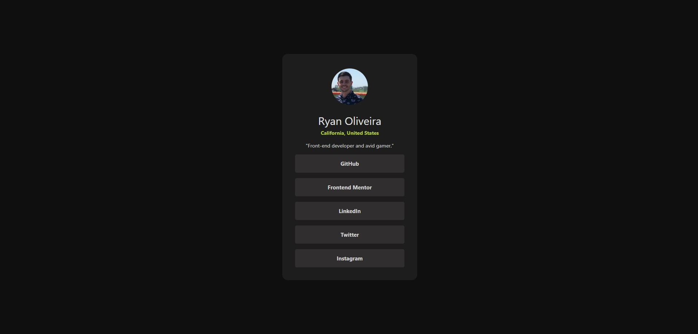

# Frontend Mentor - Social links profile solution

This is a solution to the [Social links profile challenge on Frontend Mentor](https://www.frontendmentor.io/challenges/social-links-profile-UG32l9m6dQ). Frontend Mentor challenges help you improve your coding skills by building realistic projects. 

## Table of contents

- [Overview](#overview)
  - [Screenshot](#screenshot)
  - [Links](#links)
  - [Built with](#built-with)
  - [Useful resources](#useful-resources)
- [Author](#author)

## Overview

### Screenshot




### Links

- [Solution](https://ryoliveira.github.io/social-links-profile/)

- [Live Site](https://ryoliveira.github.io/QR-component/)


### Built with

- CSS custom properties
- [Vite](https://vitejs.dev/) - Frontend dev tool
- [Vue](https://vuejs.org/) - JS Framework


### What I learned

1. How to make a nice looking link.
2 . how to concatenate selectors

```scss
.link {
    display:flex;
    justify-content: center;
    height: 50px;
    width: 100%;
    margin: 0 0 15px;
    border-radius: 5px;
    background-color: rgb(48, 47, 47);
    color: #d3d3d3;

    cursor: pointer;
    
    /* use & to add concatenate selector */
    &:hover {
        background-color: rgb(177, 205, 50);
        transition-duration: 1000ms;
        color: #000000;
    }

    .link-text {
        font-size: 15px;
        font-weight: bold;
        align-self: center;
    }
}
```

### Useful resources

- [Google Fonts](https://fonts.google.com/) - Useful to find free fonts for challenges

## Author
- Frontend Mentor - [@Ryoliveira](https://www.frontendmentor.io/profile/Ryoliveira)